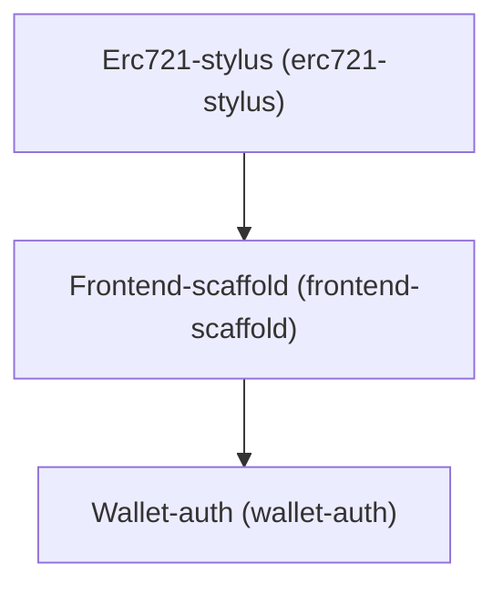

# Architecture

## Dependency Graph

```mermaid
graph TD
  2e71cf51["Erc721-stylus (erc721-stylus)"]
  74c20f50["Frontend-scaffold (frontend-scaffold)"]
  e641bde6["Wallet-auth (wallet-auth)"]
  2e71cf51 --> 74c20f50
  74c20f50 --> e641bde6
```

## Execution / Implementation Order

1. **Erc721-stylus** (`2e71cf51`)
2. **Frontend-scaffold** (`74c20f50`)
3. **Wallet-auth** (`e641bde6`)
